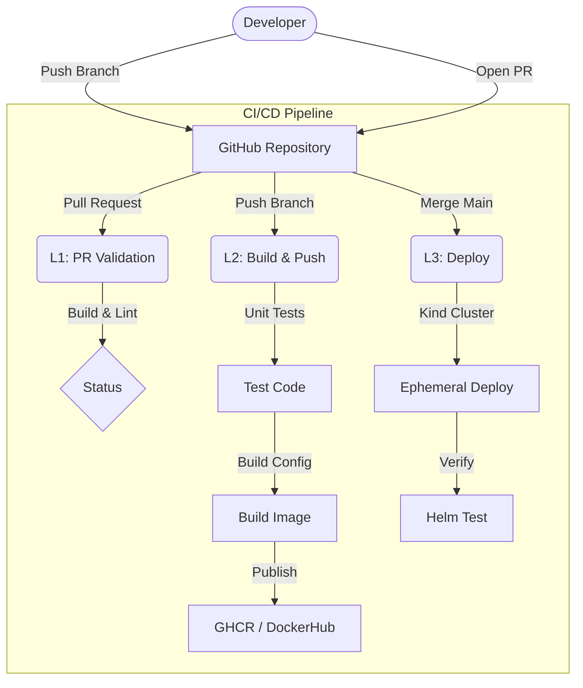

# k8s-cicd-sample-service


A reference implementation of a production-ready microservice onboarded to the [Common CI/CD Pipeline](https://github.com/haimazulay/github-k8s-cicd-templates).

## 🚀 Overview

This repository demonstrates how to build, publish, and deploy a Python Flask application using a centralized GitHub Actions pipeline. It adheres to Kubernetes best practices, including:

*   **Security**: Non-root container user (`appuser`, UID 10001).
*   **Observability**: Structured JSON logging.
*   **Reliability**: Liveness (`/healthz`) and Readiness (`/ready`) probes.
*   **Efficiency**: Multi-stage Docker builds.

## 🏗 Architecture

The CI/CD pipeline consists of three reusable workflows triggered by standard Git events.



## 🛠 Repository Structure

| File/Directory | Description |
| t| t |
| `app.py` | Production-ready Flask application with Gunicorn support. |
| `Dockerfile` | Optimized multi-stage build definition. |
| `helm/` | Helm chart with security context and resource policies. |
| `.github/workflows/` | Callers for centralized reusable workflows. |
| `requirements.txt` | Explicit Python dependencies. |

## 💻 Local Development

### 1. Run Logic Locally

```bash
# Install dependencies
pip install -r requirements.txt

# Run in development mode
python app.py
```

### 2. Run Container Locally

```bash
# Build image
docker build -t sample-service:local .

# Run container (readonly root, port 8080)
docker run --rm -p 8080:8080 --read-only --tmpfs /tmp sample-service:local
```

## ☸️ Kubernetes Configuration

The Helm chart in `helm/app-chart` is pre-configured for security:

*   **User**: `10001` (matches Dockerfile)
*   **Resources**: Limits: 500m/512Mi, Requests: 100m/128Mi
*   **Probes**: configured for low-latency startup.

## 📋 API Endpoints

| Method | Path | Description |
| :--- | :--- | :--- |
| `GET` | `/` | Hello World message. |
| `GET` | `/healthz` | Liveness probe (returns 200). |
| `GET` | `/ready` | Readiness probe (returns 200). |

## 🤝 Onboarding Guide

To adopt this pattern:

1.  Copy `.github/workflows/` to your repo.
2.  Set `image_name` to `${{ github.repository }}` in `l2-push.yml`.
3.  Ensure your `Dockerfile` supports non-root execution.
4.  Copy `helm/` and update `values.yaml` for your app specifics.